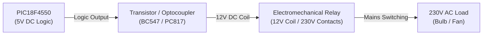

# CIE 1 - Problem 2: Home Automation Subsystem

**Course:** Embedded Processors Laboratory (EPL) [2625PC32 / 2626PC12]  
**Academic Year:** 2026–27 | **Class:** T.Y. B.Tech (E&TC)  
**Target Device:** Microchip PIC18F4550 (DIP-40)  
**Development Tools:** MPLAB IDE / MPLAB C18 v3.47 / XC8, Proteus 8 Professional  

---

## 1. Problem Statement
**Problem Statement No. 2:**  
*Home Automation Using Suitable Microcontroller.*

Design and implement a centralized appliance control subsystem using the PIC18F4550 microcontroller. The system must continuously monitor user or sensor inputs on digital input lines and independently actuate target household electrical appliances (e.g., lighting circuits, ventilation fans) through isolated digital output channels.

---

## 2. Hardware Architecture & Electrical Isolation Theory

### 2.1 The Need for Relay Drivers & Galvanic Isolation
Microcontroller GPIO pins operate at **$5.0\text{V}$ DC logic levels** with a maximum current sourcing/sinking capability of **$25\text{ mA}$**. Domestic appliances (fans, lights, air conditioners) operate on **$230\text{V AC}$ mains at currents ranging from $0.5\text{A}$ to $15\text{A}$**.

Connecting AC mains directly to an MCU pin would instantly vaporize the silicon die. A robust industrial isolation interface is strictly required:



### 2.2 Key Interface Circuit Elements
1. **Optocoupler (e.g., PC817):** Provides galvanic optical isolation (typically rated for $5000\text{V}_{RMS}$), preventing dangerous high-voltage line transients from propagating back to the microcontroller.
2. **BJT Switching Transistor (e.g., BC547 NPN):** Amplifies the low-current logic signal ($< 5\text{ mA}$) into the $50\text{ mA} - 100\text{ mA}$ required to energize the electromechanical relay coil.
3. **Freewheeling / Flyback Diode (1N4007):** Connected across the relay coil in reverse-bias. When the transistor turns off, the collapsing magnetic field of the inductive coil induces a massive reverse voltage spike ($V = -L \frac{di}{dt}$ up to hundreds of volts). The flyback diode safely clamps this spike to $V_{CC} + 0.7\text{V}$, protecting the switching transistor from collector-emitter breakdown.
4. **Input Pull-Up / Pull-Down Resistors:** Unconnected CMOS input pins act as high-impedance antennas picking up electromagnetic noise, resulting in floating, oscillating inputs. Pull-up/pull-down resistors ensure an unambiguous default logic level (`0` or `1`).

---

## 3. Hardware Interfacing & Pinout Map

| PIC18F4550 Pin | Port Pin | Direction | Signal Type | Target Component | Real-World Function |
|:---:|:---:|:---:|:---:|:---:|:---|
| <code class="pin">Pin 33</code> | **RB0** | Digital Input | Active-HIGH | Logic State 1 (Wall Switch / PIR) | Appliance 1 Controller (Room Light) |
| <code class="pin">Pin 34</code> | **RB1** | Digital Input | Active-HIGH | Logic State 2 (Wall Switch / Temp) | Appliance 2 Controller (Exhaust Fan) |
| <code class="pin">Pin 19</code> | **RD0** | Digital Output | Active-HIGH | Indicator LED / Relay Channel 1 | Appliance 1 Relay Actuator |
| <code class="pin">Pin 20</code> | **RD1** | Digital Output | Active-HIGH | Indicator LED / Relay Channel 2 | Appliance 2 Relay Actuator |
| <code class="pin">Pin 12 / 31</code> | **VSS** | Power Ground | $0\text{V}$ | Ground Reference | Common Logic Ground |
| <code class="pin">Pin 11 / 32</code> | **VDD** | Power Supply | $+5.0\text{V}$ | Microcontroller Power Rail | DC Logic Supply |

---

## 4. Firmware Code & Detailed Annotation

```c
#include <p18f4550.h>

// Basic Configuration Pragmas for Stable Operation
#pragma config FOSC = HS    // High Speed External Crystal (8 MHz)
#pragma config WDT = OFF    // Watchdog Timer Disabled
#pragma config LVP = OFF    // Low Voltage Programming Disabled

void main(void) {
    // -----------------------------------------------------------------
    // Configure Port Directions:
    // TRIS = 1 sets pin as Input; TRIS = 0 sets pin as Output.
    // -----------------------------------------------------------------
    TRISB = 0xFF; // Set all 8 pins of PORTB as Inputs (1111 1111)
    TRISD = 0x00; // Set all 8 pins of PORTD as Outputs (0000 0000)
    
    // Ensure all output relays / appliances are deactivated upon initial power-up
    PORTD = 0x00;
    
    while(1) { // Continuous Real-Time Sensing and Actuation Loop
        
        // -------------------------------------------------------------
        // Channel 1: Room Light Control (Sensor on RB0 -> Relay on RD0)
        // -------------------------------------------------------------
        if(PORTBbits.RB0 == 1) {
            PORTDbits.RD0 = 1; // Energize Relay 1 (Turn ON Light)
        } else {
            PORTDbits.RD0 = 0; // De-energize Relay 1 (Turn OFF Light)
        }
        
        // -------------------------------------------------------------
        // Channel 2: Ventilation Fan Control (Sensor on RB1 -> Relay on RD1)
        // -------------------------------------------------------------
        if(PORTBbits.RB1 == 1) {
            PORTDbits.RD1 = 1; // Energize Relay 2 (Turn ON Fan)
        } else {
            PORTDbits.RD1 = 0; // De-energize Relay 2 (Turn OFF Fan)
        }
    }
}
```

---

## 5. Proteus Simulation Setup Instructions

1. Open **Proteus 8 Professional** and load `Home_Automation.pdsprj`.
2. Required parts from Proteus library:
   - `PIC18F4550`
   - `LOGICSTATE` (two components: one for RB0, one for RB1)
   - `LED-BLUE`, `LED-GREEN` (representing appliances on RD0 and RD1)
   - `RES` ($330\,\Omega$ series resistors)
3. Connections:
   - Connect output of `LOGICSTATE` 1 to pin `RB0`.
   - Connect output of `LOGICSTATE` 2 to pin `RB1`.
   - Connect pin `RD0` through $330\,\Omega$ to Anode of `LED-BLUE`; Cathode to GND.
   - Connect pin `RD1` through $330\,\Omega$ to Anode of `LED-GREEN`; Cathode to GND.
4. Program the microcontroller:
   - Double-click the `PIC18F4550` component.
   - Set **Processor Clock Frequency** to `8MHz`.
   - Load **Program File**: Browse to `Q3.hex` (or `main.hex`).
5. Click **Play** to run simulation:
   - Toggle `LOGICSTATE` on RB0 from 0 to 1 $\implies$ Blue LED (Light) turns ON immediately.
   - Toggle `LOGICSTATE` on RB1 from 0 to 1 $\implies$ Green LED (Fan) turns ON immediately.
   - Toggle both to 0 $\implies$ Both LEDs turn OFF cleanly.

---

## 6. Comprehensive Viva Voce & Oral Examination Guide

### Level 1: Fundamental / Conceptual Questions ("What & Why")

#### Q1.1: What is home automation, and what role does the microcontroller play?
**Answer:**  
Home automation is the automated, centralized control of household electrical appliances and subsystems (lighting, HVAC, security). The microcontroller acts as the intelligent embedded hub:
1. It gathers inputs from wall switches, PIR motion sensors, temperature probes, or wireless transceivers.
2. It processes the logical rules (threshold comparison, timing, interlocks).
3. It dispatches actuation signals to electromechanical relays, triacs, or solid-state relays (SSRs).

#### Q1.2: Why can't a PIC18F microcontroller drive a 230V AC ceiling fan directly from its I/O pin?
**Answer:**  
Two critical electrical mismatches prevent direct connection:
1. **Voltage Discrepancy:** The PIC operates on $+5\text{V}$ DC logic. AC mains is $230\text{V}_{RMS}$ ($325\text{V}$ peak) AC. Direct connection would rupture internal insulation and destroy the chip.
2. **Current Limitations:** The PIC18F GPIO pin can source a maximum of $25\text{ mA}$. A standard domestic fan draws between $300\text{ mA}$ and $500\text{ mA}$ ($75\text{ W}$), exceeding the pin rating by a factor of 20. Hence, an intermediate switching stage (relay or triac) is mandatory.

#### Q1.3: What is the difference between an input port and an output port at the hardware register level?
**Answer:**  
The data direction is controlled by the **TRIS (Tri-State)** register:
- **Input (`TRIS = 1`):** The internal output MOSFET drivers are placed in a high-impedance (Hi-Z / disconnected) state. The physical pin voltage is routed directly to an input buffer (Schmitt trigger or CMOS buffer) which charges the internal read register without loading the external signal.
- **Output (`TRIS = 0`):** The internal push-pull complementary MOSFET drivers are enabled, actively driving the pin to either $V_{DD}$ ($+5\text{V}$) or $V_{SS}$ ($0\text{V}$) with low impedance.

---

### Level 2: Easy / Direct Implementation Questions

#### Q2.1: What does `TRISB = 0xFF;` do in binary and functional terms?
**Answer:**  
`0xFF` is `1111 1111` in binary. In PIC architecture, a `1` in the TRIS register configures the pin as an **Input** ("1 looks like I for Input"). Thus, `TRISB = 0xFF;` sets all 8 pins (RB0 to RB7) of Port B as digital inputs.

#### Q2.2: How does `if(PORTBbits.RB0 == 1)` evaluate the physical voltage on pin RB0?
**Answer:**  
`PORTBbits` is a compiler-defined bit-field structure mapped directly to the Special Function Register (SFR) address of Port B. `PORTBbits.RB0` accesses Bit 0:
- When the external switch applies $5.0\text{V}$ ($> V_{IH} \approx 2.0\text{V}$), the internal Schmitt trigger latches logic `1`, evaluating the `if` statement to `TRUE`.
- When the switch applies $0\text{V}$ ($< V_{IL} \approx 0.8\text{V}$), it reads logic `0`, evaluating to `FALSE`.

#### Q2.3: Why is `PORTD = 0x00;` executed before entering the `while(1)` loop?
**Answer:**  
Upon microcontroller power-on reset, register contents (especially port output latches) may hold undefined or indeterminate states. Executing `PORTD = 0x00;` guarantees a known, deterministic, and safe power-up state where all connected high-power appliances are initially turned OFF, preventing accidental activation during system boot.

---

### Level 3: Moderate / Practical Circuit Design Questions

#### Q3.1: Why is a flyback / freewheeling diode essential across an inductive relay coil? What happens if it is omitted?
**Answer:**  
An electromechanical relay coil is an inductor ($L$). When current flows through it, magnetic energy is stored ($E = \frac{1}{2} L I^2$). When the driving transistor suddenly turns off to de-energize the relay, the rapid drop in current ($\frac{di}{dt} \to -\infty$) generates a massive inductive back-EMF spike:
$$V_{spike} = -L \frac{di}{dt}$$
This voltage can exceed several hundred volts with reverse polarity. Without a reverse-biased **flyback diode** (like 1N4007) connected across the coil to recirculate and dissipate the stored current safely, this high voltage exceeds the breakdown voltage ($V_{CEO}$) of the driver transistor, destroying it immediately.

#### Q3.2: What is "switch contact bounce", and how do you resolve it in a home automation system?
**Answer:**  
Mechanical switches and pushbuttons do not close cleanly; their metal contacts physically bounce against each other for $5\text{ ms}$ to $20\text{ ms}$ before settling. Because the MCU executes millions of instructions per second, it reads these rapid bounces as dozens of rapid on/off switch presses.  
**Solutions:**
1. **Software Debouncing:** After detecting an edge, insert a non-blocking $20\text{ ms}$ timer delay and sample the pin again to confirm the stable state.
2. **Hardware Debouncing:** Place an RC low-pass filter ($R = 10\text{ k}\Omega, C = 100\text{ nF}$) followed by a Schmitt Trigger gate (e.g., 74HC14) before the MCU input.

#### Q3.3: How would you convert momentary pushbutton presses into a latching "Push-ON / Push-OFF" toggle switch?
**Answer:**  
Instead of mirroring the instantaneous pin state, detect the **rising or falling edge** (transition from 0 to 1) and toggle a software state variable:
```c
if(PORTBbits.RB0 == 1 && previous_button_state == 0) {
    delay_ms(20); // Debounce
    if(PORTBbits.RB0 == 1) {
        light_state = !light_state; // Toggle boolean state
        PORTDbits.RD0 = light_state;
    }
}
previous_button_state = PORTBbits.RB0;
```

---

### Level 4: Tough / In-Depth & Troubleshooting Questions

#### Q4.1: Why does relay switching sometimes cause the microcontroller to freeze or reboot spontaneously in real hardware? How do you prevent it?
**Answer:**  
When an electromechanical relay switches inductive AC loads (motors, fluorescent ballasts), an electrical arc forms across the contacts, producing severe **Electromagnetic Interference (EMI)** and high-frequency voltage transients on the common DC ground and power rails.  
**Preventative Hardware Measures:**
1. **Galvanic Optocoupler Isolation:** Use optocouplers (PC817) so that the MCU logic ground and the 12V relay coil ground are completely physically separated.
2. **RC Snubber Circuit:** Place a series resistor-capacitor snubber ($100\,\Omega + 0.1\,\mu\text{F}$ Class X2 rated) across the AC relay contacts to quench arcing.
3. **Decoupling Capacitors:** Place $0.1\,\mu\text{F}$ ceramic bypass capacitors right across the $V_{DD}$ and $V_{SS}$ pins of the PIC18F to filter out high-frequency power spikes.

#### Q4.2: How would you convert this polling mechanism into an Interrupt-on-Change (IOC) architecture for ultra-low power consumption?
**Answer:**  
Pins `RB4` to `RB7` on PIC18F support **Interrupt-on-Change (IOC)**:
1. Connect switches to pins `RB4` and `RB5`.
2. Configure the interrupt:
   ```c
   INTCONbits.RBIE = 1; // Enable Port B change interrupt
   INTCONbits.GIE = 1;  // Enable global interrupts
   ```
3. In `main()`, place the microcontroller into sleep mode (`Sleep();`).
4. When any switch is toggled, the voltage change asserts the `RBIF` flag, waking the CPU from low-power sleep mode instantly to service the relay state in the ISR, reducing idle current consumption from $\sim 15\text{ mA}$ down to $< 1\,\mu\text{A}$.

#### Q4.3: How would you adapt this architecture to support smartphone or Wi-Fi control?
**Answer:**  
1. Connect an **ESP8266 / ESP32** Wi-Fi coprocessor to the PIC18F hardware USART pins (`RC6/TX` and `RC7/RX`) communicating at 115200 baud.
2. The ESP module connects to the local home Wi-Fi network and subscribes to an **MQTT broker** (e.g., Adafruit IO, HiveMQ) or hosts a local Web UI.
3. When the user taps a button on their phone, the ESP publishes a command string (e.g., `CMD:LIGHT:ON\r\n`) over UART to the PIC18F, which decodes the command via its serial receive interrupt (`RCIF`) and switches the corresponding relay pin.
