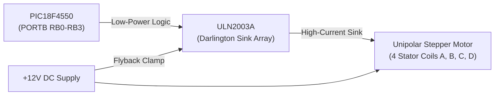

# CIE 1 - Problem 13: Stepper Motor Interfacing (90° Bidirectional Rotation)

**Course:** Embedded Processors Laboratory (EPL) [2625PC32 / 2626PC12]  
**Academic Year:** 2026–27 | **Class:** T.Y. B.Tech (E&TC)  
**Target Device:** Microchip PIC18F4550 (DIP-40)  
**Development Tools:** MPLAB IDE / MPLAB C18 v3.47 / XC8, Proteus 8 Professional  

---

## 1. Problem Statement
**Problem Statement No. 13:**  
*Interface a Stepper motor and rotate the motor clockwise and anticlockwise by 90 degrees.*

The embedded system must interface a 4-phase unipolar stepper motor to the PIC18F4550 via a ULN2003A Darlington driver array. The firmware must rotate the motor shaft precisely **$90^\circ$ Clockwise (CW)**, pause for 1 second, rotate **$90^\circ$ Anti-Clockwise (CCW)**, pause for 1 second, and continuously repeat this bidirectional indexing sequence without accumulating angular drift.

---

## 2. Stepper Motor Architecture & Electromagnetics

### 2.1 Unipolar vs. Bipolar Stepper Motors
- **Unipolar Stepper Motor:** Features two center-tapped stator windings (often wired as 5 or 6 leads). The center taps are connected to a permanent positive DC supply ($+5\text{V}$ or $+12\text{V}$). Rotation is produced simply by energizing one coil half at a time by sinking its terminal to Ground. This allows drive circuits using simple low-side NPN/Darlington switches (such as **ULN2003A**) without requiring dual H-bridges.
- **Bipolar Stepper Motor:** Features two coils without center taps (4 leads). To reverse magnetic flux polarity in a coil, current direction through the coil must be reversed, requiring an **H-Bridge driver** (e.g., L293D or L298N).



### 2.2 Mathematical Derivation of Step Count
A standard hybrid stepper motor has a resolution characterized by its **Step Angle ($\theta_s$)**, typically **$1.8^\circ$ per full step**:
1. **Total Steps per Full Revolution ($360^\circ$):**
   $$N_{rev} = \frac{360^\circ}{\theta_s} = \frac{360^\circ}{1.8^\circ} = 200\text{ steps/rev}$$
2. **Steps Required for $90^\circ$ Angular Rotation:**
   $$N_{90^\circ} = \frac{\text{Target Angle}}{\text{Step Angle}} = \frac{90^\circ}{1.8^\circ} = 50\text{ steps}$$

> [!IMPORTANT]
> To rotate through exactly $90^\circ$, the microcontroller must issue precisely **50 sequential step excitations**.

### 2.3 Excitation Sequence (2-Phase Full-Step Mode)
In 2-Phase Full-Step excitation, two adjacent coils are energized simultaneously at every step. This provides **maximum magnetic torque** and higher positioning stiffness compared to 1-phase wave drive:

```text
Stator Coils: A (RB0), B (RB1), C (RB2), D (RB3)
```

| Step Index | Coil D (RB3) | Coil C (RB2) | Coil B (RB1) | Coil A (RB0) | Binary Byte | Hex Value |
|:---:|:---:|:---:|:---:|:---:|:---:|:---:|
| **Step 0** | 1 | 0 | 0 | 1 | `0000 1001` | **`0x09`** |
| **Step 1** | 1 | 1 | 0 | 0 | `0000 1100` | **`0x0C`** |
| **Step 2** | 0 | 1 | 1 | 0 | `0000 0110` | **`0x06`** |
| **Step 3** | 0 | 0 | 1 | 1 | `0000 0011` | **`0x03`** |

- **Clockwise (CW) Sequence:** `{0x09, 0x0C, 0x06, 0x03}`
- **Counter-Clockwise (CCW) Sequence:** `{0x03, 0x06, 0x0C, 0x09}` (Exact reverse order)

---

## 3. Hardware Interfacing & Pinout Map

| PIC18F4550 Pin | Port Pin | Direction | ULN2003A Pin | Motor Coil | Electrical Function |
|:---:|:---:|:---:|:---:|:---:|:---|
| <code class="pin">Pin 33</code> | **RB0** | Output | IN1 (Pin 1) $\to$ OUT1 (Pin 16) | **Coil A** | Phase 1 Low-side Driver |
| <code class="pin">Pin 34</code> | **RB1** | Output | IN2 (Pin 2) $\to$ OUT2 (Pin 15) | **Coil B** | Phase 2 Low-side Driver |
| <code class="pin">Pin 35</code> | **RB2** | Output | IN3 (Pin 3) $\to$ OUT3 (Pin 14) | **Coil C** | Phase 3 Low-side Driver |
| <code class="pin">Pin 36</code> | **RB3** | Output | IN4 (Pin 4) $\to$ OUT4 (Pin 13) | **Coil D** | Phase 4 Low-side Driver |
| — | — | — | **GND (Pin 8)** | — | Common Ground Return |
| — | — | — | **COM (Pin 9)** | Motor Center Tap | Connected to $+12\text{V}$ (Internal Flyback Clamp Diodes) |

---

## 4. Firmware Code & Detailed Annotation

```c
#include <p18f4550.h>

// Microcontroller Configuration Pragmas
#pragma config FOSC = HS    // High-Speed External Crystal Oscillator (8 MHz)
#pragma config WDT = OFF    // Watchdog Timer Disabled
#pragma config LVP = OFF    // Low-Voltage ICSP Disabled

// Software delay loop calibrated for ~1 ms per count at 8 MHz
void delay_ms(unsigned int ms) {
    unsigned int i, j;
    for(i = 0; i < ms; i++) {
        for(j = 0; j < 165; j++); // 165 iterations ≈ 1 ms at Fosc = 8 MHz
    }
}

void main(void) {
    // 2-Phase Full-Step excitation sequence tables
    unsigned char cw_seq[]  = {0x09, 0x0C, 0x06, 0x03}; // Clockwise sequence
    unsigned char ccw_seq[] = {0x03, 0x06, 0x0C, 0x09}; // Counter-clockwise sequence
    
    // 90 degrees / 1.8 degrees per step = 50 steps
    int steps_for_90 = 50; 
    int i; // Loop counter variable
    
    // Configure lower nibble of PORTB as digital outputs
    TRISB = 0x00;
    
    // Ensure motor coils are initially de-energized
    PORTB = 0x00;
    
    while(1) { // Continuous bidirectional rotation loop
        
        // -------------------------------------------------------------
        // Phase 1: Rotate 90 Degrees Clockwise (CW)
        // -------------------------------------------------------------
        for(i = 0; i < steps_for_90; i++) {
            PORTB = cw_seq[i % 4]; // Modulo 4 cycles through the 4-step sequence
            delay_ms(100);         // 100 ms inter-step delay sets rotation speed
        }
        
        // Dwell / Hold state: pause for 1000 ms at 90-degree position
        delay_ms(1000);
        
        // -------------------------------------------------------------
        // Phase 2: Rotate 90 Degrees Counter-Clockwise (CCW) Back to 0°
        // -------------------------------------------------------------
        for(i = 0; i < steps_for_90; i++) {
            PORTB = ccw_seq[i % 4]; // Modulo 4 cycles through reverse sequence
            delay_ms(100);          // 100 ms inter-step delay
        }
        
        // Dwell / Hold state: pause for 1000 ms at 0-degree position
        delay_ms(1000);
    }
}
```

---

## 5. Proteus Simulation Setup Instructions

1. Open **Proteus 8 Professional** and load `Stepper_Motor_90_Deg.pdsprj`.
2. Required Components from Proteus:
   - `PIC18F4550`
   - `ULN2003A` (Darlington Driver IC)
   - `MOTOR-STEPPER` (Unipolar 4-phase stepper motor)
3. Interfacing Connections:
   - Connect `RB0, RB1, RB2, RB3` to `IN1, IN2, IN3, IN4` of ULN2003A.
   - Connect `OUT1, OUT2, OUT3, OUT4` of ULN2003A to the 4 motor coil terminals.
   - Wire Pin 8 of ULN2003A to **GROUND**.
   - Wire Pin 9 (`COM`) of ULN2003A and the two common wires of the motor to a $+12\text{V}$ DC **POWER** terminal.
4. Motor Properties in Proteus:
   - Double click the `MOTOR-STEPPER` component.
   - Verify that **Step Angle** is set to `1.8` degrees and **Coil Resistance** is set to $10\,\Omega$ or $100\,\Omega$.
5. Microcontroller Configuration:
   - Double-click the `PIC18F4550` component.
   - Set **Processor Clock Frequency** to `8MHz`.
   - Browse and attach `Q3.hex` (or `main.hex`).
6. Click **Play**:
   - The motor indicator dial steps smoothly clockwise from $0^\circ$ up to $+90^\circ$.
   - Stops for 1 second.
   - Steps smoothly counter-clockwise back to $0^\circ$.
   - Stops for 1 second and loops continuously.

---

## 6. Comprehensive Viva Voce & Oral Examination Guide

### Level 0: Fundamental Line-by-Line Code Breakdown ("What Does This Line Mean & Why Did You Write It?")

#### Q0.1: Why did you write `#include <p18f4550.h>`? What does it provide, and what happens if you omit it?
**Answer:**  
- **What it means:** A C preprocessor directive that imports the hardware register definition header for the PIC18F4550 microcontroller.
- **Why we wrote it:** It defines the hardware addresses for `TRISB` and `PORTB`. Without this include, compiling `TRISB = 0x00;` or `PORTB = 0x00;` results in fatal "undefined symbol" errors.

#### Q0.2: What do `#pragma config FOSC = HS`, `WDT = OFF`, `LVP = OFF` do?
**Answer:**  
- **`FOSC = HS`:** Selects High-Speed Crystal Oscillator mode ($8\text{ MHz}$).
- **`WDT = OFF`:** Turns OFF the Watchdog Timer to prevent unprompted watchdog resets during the 1-second holding delays.
- **`LVP = OFF`:** Disables Low-Voltage ICSP programming, releasing pin `RB5` from programming duty to standard digital I/O.

#### Q0.3: What does `void delay_ms(unsigned int ms)` do? Why is it fundamental to stepper motor operation?
**Answer:**  
- **What it does:** Generates a software delay proportional to `ms` using nested decrement loops calibrated for 8 MHz ($1\text{ ms}$ per count).
- **Why fundamental to stepper motors:** A stepper motor cannot advance instantaneously. Each step requires time for the rotor magnetic field to align with the energized stator coils. `delay_ms()` establishes the step rate (frequency). Changing the delay value directly modulates the motor's rotational speed (RPM).

#### Q0.4: Why did you declare `unsigned char cw_seq[] = {0x09, 0x0C, 0x06, 0x03};`? Where do these 4 exact numbers come from?
**Answer:**  
- **`unsigned char`:** An 8-bit unsigned type ($1\text{ byte}$), matching the 8-bit width of `PORTB`.
- **Derivation of the 4 values (2-Phase Full-Step Excitation):**
  - Stator coils A, B, C, D are connected to pins `RB0`, `RB1`, `RB2`, `RB3`.
  - **`0x09`** = `0000 1001` (Coil D and Coil A energized)
  - **`0x0C`** = `0000 1100` (Coil D and Coil C energized)
  - **`0x06`** = `0000 0110` (Coil C and Coil B energized)
  - **`0x03`** = `0000 0011` (Coil B and Coil A energized)  
  At each step, two adjacent coils are energized, creating a composite magnetic stator flux vector that rotates spatially by $90^\circ$ electrical, pulling the permanent-magnet rotor along with it.

#### Q0.5: Why did you declare `unsigned char ccw_seq[] = {0x03, 0x06, 0x0C, 0x09};`? Why is it the exact reverse of `cw_seq`?
**Answer:**  
To rotate the rotor in the reverse (anti-clockwise) direction, the stator magnetic vector must rotate in the opposite spatial direction. Reversing the order of coil excitation (`0x03` $\to$ `0x06` $\to$ `0x0C` $\to$ `0x09`) shifts the magnetic field counter-clockwise, forcing the rotor teeth to follow in reverse.

#### Q0.6: Why did you write `int steps_for_90 = 50;`? Show the exact formula.
**Answer:**  
- **Standard Stepper Motor Step Angle ($\theta_s$):** $1.8^\circ$ per full step.
- **Formula:**
  $$\text{Steps} = \frac{\text{Target Angle}}{\text{Step Angle}} = \frac{90^\circ}{1.8^\circ} = 50\text{ steps}$$
Therefore, the motor must execute exactly 50 sequential step transitions to sweep an angular displacement of $90^\circ$ (one quadrant of a full circle).

#### Q0.7: Why did you declare `int i;` at the beginning of `main()`?
**Answer:**  
In ANSI C89 (the standard enforced by the Microchip MPLAB C18 compiler), all local variables within a block must be declared before any executable C statements. Declaring `for(int i = 0; ...)` mid-block triggers a syntax error in C18.

#### Q0.8: What do `TRISB = 0x00;` and `PORTB = 0x00;` do?
**Answer:**  
- **`TRISB = 0x00;`:** Sets all 8 pins of Port B as digital outputs (`0` = Output), enabling the microcontroller to drive the ULN2003A inputs.
- **`PORTB = 0x00;`:** Drives all Port B pins to logic LOW ($0\text{V}$), turning off all Darlington transistor pairs in the ULN2003A and ensuring that no motor coils draw current on power-up.

#### Q0.9: What does `while(1)` mean?
**Answer:**  
It creates an infinite loop. `1` evaluates to Boolean TRUE, meaning the microcontroller continuously alternates between $90^\circ$ CW and $90^\circ$ CCW rotation indefinitely until power is turned off.

#### Q0.10: In `PORTB = cw_seq[i % 4];`, what does the `%` (modulo) operator do? Why is `% 4` used?
**Answer:**  
- **What `%` does:** In C, `%` calculates the integer remainder of division.
- **Why `% 4` is used:** Our full-step excitation sequence has 4 states (indices $0, 1, 2, 3$). But to achieve $90^\circ$, loop counter `i` runs from $0$ up to $49$ ($50\text{ iterations}$).
- As `i` increments:
  - `i = 0` $\implies 0 \% 4 = 0 \implies \text{cw\_seq}[0] = 0x09$
  - `i = 1` $\implies 1 \% 4 = 1 \implies \text{cw\_seq}[1] = 0x0C$
  - `i = 2` $\implies 2 \% 4 = 2 \implies \text{cw\_seq}[2] = 0x06$
  - `i = 3` $\implies 3 \% 4 = 3 \implies \text{cw\_seq}[3] = 0x03$
  - `i = 4` $\implies 4 \% 4 = 0 \implies \text{cw\_seq}[0] = 0x09$ (wraps around!)  
The `% 4` operator cleanly wraps the index so that the 4-step sequence repeats smoothly 12.5 times ($12.5 \times 4 = 50\text{ steps}$).

#### Q0.11: Why is there `delay_ms(100);` after every single step excitation? What does this 100 ms control?
**Answer:**  
- **What it controls:** It sets the **inter-step interval**, which determines the motor's stepping rate and rotational speed.
- **Why 100 ms:** At $100\text{ ms}$ per step, the motor steps at $f = \frac{1}{0.1\text{ s}} = 10\text{ steps/sec}$, yielding a rotational speed of $\frac{10 \times 60}{200} = 3\text{ RPM}$. This slow speed allows students and evaluators to clearly observe each individual step in Proteus and ensures the rotor does not skip steps due to rotational inertia.

#### Q0.12: Why is there a separate `delay_ms(1000);` outside the step loop? What does it achieve physically on the motor shaft?
**Answer:**  
- **What it achieves (Dwell / Settle Time):** When the motor finishes stepping through $50\text{ steps}$ ($90^\circ$), `delay_ms(1000)` pauses the firmware for 1 full second.
- **Physical consequence:** During this pause, the last energized coils (`cw_seq[49 % 4] = cw_seq[1] = 0x0C`) remain active. This applies active **Holding Torque**, locking the motor shaft firmly at the exact $90^\circ$ angular position and absorbing any residual mechanical oscillations before changing direction to CCW.

---

### Level 1: Fundamental / Conceptual Questions ("What & Why")

#### Q1.1: What is a stepper motor, and why is it categorized as an open-loop positioning actuator?
**Answer:**  
A stepper motor is a brushless synchronous electromechanical actuator that converts digital electrical pulses into discrete mechanical angular movements (steps). It is categorized as **open-loop** because the motor shaft advances by a fixed, known angle for every pulse sequence applied without requiring position feedback sensors (such as encoders or resolvers). The controller tracks absolute position simply by keeping count of the emitted pulses.

#### Q1.2: Why can't a microcontroller pin directly drive a stepper motor coil?
**Answer:**  
1. **Current Requirement:** Microcontroller pins can source or sink a maximum of $25\text{ mA}$. Stepper motor coils require hundreds of milliamperes to several amperes ($500\text{ mA} - 2\text{ A}$) to establish sufficient magnetic flux across the air gap.
2. **Inductive Back-EMF:** When a coil is de-energized, its magnetic field collapses, generating an inductive kickback voltage ($V = -L \frac{di}{dt}$) reaching upwards of $100\text{V}$, which would instantly destroy unprotected CMOS logic pins.

#### Q1.3: What is the ULN2003A IC, and why is it chosen for unipolar stepper motor driving?
**Answer:**  
The **ULN2003A** is an array of seven high-voltage, high-current **Darlington transistor pairs**. Each channel can sink up to $500\text{ mA}$ at voltages up to $50\text{V}$. Crucially, it integrates on-chip **freewheeling suppression diodes** connected to pin 9 (`COM`), eliminating the need to solder separate external flyback diodes across each motor coil.

#### Q1.4: What is the difference between Holding Torque and Detent Torque?
**Answer:**  
- **Holding Torque:** The maximum external torque that can be applied to the motor shaft without causing continuous rotation when the motor windings are energized with DC rated current.
- **Detent Torque:** The small residual holding torque produced by the permanent magnets acting on the stator teeth when the motor coils are completely unpowered (zero current).

---

### Level 2: Easy / Direct Implementation Questions

#### Q2.1: How is the number of steps calculated for a 90° rotation?
**Answer:**  
Given that a standard stepper motor advances by $1.8^\circ$ per full step:
$$\text{Steps for } 90^\circ = \frac{\text{Target Angle}}{\text{Step Angle}} = \frac{90^\circ}{1.8^\circ} = 50\text{ steps}$$
Thus, 50 step iterations rotate the rotor through exactly a quarter turn ($90^\circ$).

#### Q2.2: Explain the significance of the array `{0x09, 0x0C, 0x06, 0x03}`.
**Answer:**  
These 4 hex values correspond to the 2-phase full-step excitation sequence:
- `0x09` = `0000 1001` (Coil D and Coil A energized)
- `0x0C` = `0000 1100` (Coil D and Coil C energized)
- `0x06` = `0000 0110` (Coil C and Coil B energized)
- `0x03` = `0000 0011` (Coil B and Coil A energized)  
Two adjacent coils are active simultaneously, shifting the composite stator magnetic vector by $90\text{ electrical degrees}$ at each step, forcing the rotor teeth to align.

#### Q2.3: Why does `i % 4` appear inside `cw_seq[i % 4]`?
**Answer:**  
The modulo operator (`% 4`) wraps the step index `i` (which runs from $0$ to $49$) into the repeating 4-element range $[0, 1, 2, 3]$. As `i` progresses $0, 1, 2, 3, 4, 5...$, `i % 4` produces $0, 1, 2, 3, 0, 1...$, smoothly looping the 4-phase sequence 12.5 times to complete 50 steps.

#### Q2.4: Why does reversing the array order to `{0x03, 0x06, 0x0C, 0x09}` reverse the physical rotation?
**Answer:**  
Reversing the sequence reverses the spatial direction of the rotating magnetic stator field. The permanent-magnet rotor aligns with the moving stator flux vector; hence, rotating the magnetic vector in the reverse spatial direction forces the rotor to step in the opposite (counter-clockwise) physical direction.

---

### Level 3: Moderate / Operational Dynamics & Driving Schemes

#### Q3.1: What determines the rotational speed of the stepper motor in this program?
**Answer:**  
The rotational speed is determined by the **step frequency (pulse rate)**, controlled by `delay_ms(100)`:
- Time per step: $T_{step} = 100\text{ ms} = 0.1\text{ s}$.
- Step frequency: $f_{step} = \frac{1}{T_{step}} = 10\text{ steps/second}$.
- Rotational speed in RPM (Revolutions Per Minute):
  $$\text{RPM} = \frac{f_{step} \times 60}{\text{Steps per revolution}} = \frac{10 \times 60}{200} = 3\text{ RPM}$$
Decreasing the delay from $100\text{ ms}$ to $10\text{ ms}$ accelerates the speed from $3\text{ RPM}$ to $30\text{ RPM}$.

#### Q3.2: What happens if the delay between steps is reduced too aggressively (e.g., from 100 ms to 1 ms)?
**Answer:**  
The motor will **stall and skip steps**:
Mechanical rotors possess physical inertia ($J$). At each step, the rotor must overcome mechanical inertia and accelerate to the next alignment position. If the stator field steps faster than the rotor can mechanically follow (exceeding the motor's **Pull-in Rate**), the rotor falls out of phase with the stator field. The motor stops rotating and merely vibrates or hums in place.

#### Q3.3: Compare Wave Drive (1-Phase ON), Full-Step (2-Phase ON), and Half-Step drive modes.
**Answer:**  
1. **Wave Drive (1-Phase ON):** Only 1 coil energized at any instant (`0x01, 0x02, 0x04, 0x08`). Consumes the least electrical power, but provides the lowest holding torque.
2. **Full-Step (2-Phase ON):** Two coils energized simultaneously (`0x09, 0x0C, 0x06, 0x03`). Consumes twice the power of wave drive, but yields $\approx 41\%$ higher holding torque and higher positioning stiffness.
3. **Half-Step (1-2 Phase Alternating):** Alternates between 1 and 2 active phases (`0x01, 0x03, 0x02, 0x06...`). Halves the effective step angle (e.g. from $1.8^\circ$ to $0.9^\circ$), doubling positional resolution and dramatically dampening mechanical resonance.

#### Q3.4: Why is it vital to connect Pin 9 (COM) of ULN2003A to +12V?
**Answer:**  
Pin 9 of the ULN2003A is the common cathode connection for all seven internal freewheeling clamp diodes. Connecting Pin 9 to the motor's $+12\text{V}$ power rail ensures that when any Darlington output transistor turns off, the inductive voltage spike generated by that coil is safely clamped to $+12\text{V} + 0.7\text{V} \approx 12.7\text{V}$. Leaving Pin 9 unconnected leaves the clamp diodes floating, allowing inductive spikes to exceed $50\text{V}$ and destroy the output transistors.

---

### Level 4: Tough / In-Depth & Troubleshooting Questions

#### Q4.1: What is "Mechanical Resonance" in stepper motors, and how is it mitigated?
**Answer:**  
A stepper motor system behaves as a spring-mass torsional system (magnetic field acts as a magnetic spring, rotor mass acts as inertia). Every discrete step excites an underdamped oscillatory motion (ringing) before settling. If the step pulse frequency matches the natural mechanical frequency of the motor (typically between $50\text{ Hz}$ and $200\text{ Hz}$), the rotor oscillations amplify exponentially, resulting in severe torque loss, loud buzzing, and complete stall.  
**Mitigation Techniques:**
1. **Microstepping:** Driving the coils with sinusoidal PWM currents rather than square pulses, moving the magnetic vector in fractional micro-increments.
2. **Mechanical Dampers:** Affixing viscous or elastomeric inertia rings to the motor shaft.
3. **Acceleration Ramping:** Rapidly accelerating through the resonance frequency band using a trapezoidal speed curve rather than lingering at the resonant frequency.

#### Q4.2: The motor hums and vibrates violently in Proteus or on hardware, but the shaft doesn't turn. What are the three most probable causes?
**Answer:**  
1. **Incorrect Phase Wiring Sequence:** If the 4 coil wires (A, B, C, D) are scrambled (e.g., A, C, B, D connected instead of A, B, C, D), the magnetic vector jumps back and forth rather than rotating in a circle. The rotor simply vibrates back and forth between two poles.
2. **Excessive Step Frequency (Starting too fast):** Attempting to start the motor instantly at high speed without an acceleration ramp exceeds the motor's starting pull-in torque.
3. **Insufficient Driver Power Supply:** The motor power supply is under-rated or voltage has sagged below the minimum required coil threshold under load.

#### Q4.3: How can an open-loop stepper system detect a stall or establish an absolute origin (Homing)?
**Answer:**  
Since open-loop steppers have no position feedback:
1. **Limit Switch / Optical Homing:** Upon system initialization, the motor steps in reverse until it activates a physical microswitch or slotted optical sensor (photomicrosensor). The microcontroller registers the interrupt and sets its step counter to zero (`Home Position = 0`).
2. **Sensorless Stall Detection (Back-EMF Sensing):** Advanced dedicated drivers (such as Trinamic TMC2209 with StallGuard) monitor the back-EMF waveform and phase angle between coil current and voltage. When the rotor physically stalls against an obstacle, the back-EMF drops to zero and phase shift changes abruptly, triggering a stall interrupt to the MCU without requiring external switches.
