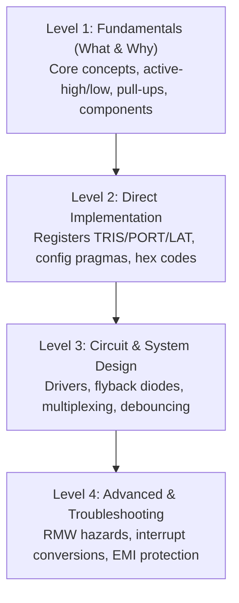

# Continuous Internal Evaluation (CIE 1) Solutions & Comprehensive Viva Guide

**Course:** Embedded Processors Laboratory (EPL) [2625PC32 / 2626PC12]  
**Class:** T.Y. B.Tech (Electronics & Telecommunication Engineering)  
**Academic Year:** 2026–27  
**Department:** Department of Electronics & Telecommunication Engineering  
**Institution:** Pune Institute of Computer Technology (PICT), Pune – 411043  

---

## 1. Overview of CIE 1 Laboratory Evaluation

The Continuous Internal Evaluation 1 (CIE 1) assesses practical hardware interfacing, bare-metal microcontroller firmware development, and electronic circuit simulation skills using **PIC18F4550** and **Proteus 8 Professional / MPLAB C18 / XC8**.

Each project in this directory contains:
- Complete bare-metal **Embedded C firmware** (`main.c`)
- Pre-compiled production artifacts (`.hex`, `.cof`, `.map`)
- Fully wired **Proteus 8 Professional Schematic Simulation** (`.pdsprj`)
- Formal academic submission documentation (`Report.md`)
- Step-by-step Proteus execution instructions (`Proteus_Instructions.txt`)
- In-depth technical documentation with **Graded Viva Voce Question Banks** (`README.md`)

---

## 2. Project Directory Map & Comparison Matrix

| No. | Project Directory | Problem Statement | Core Hardware Peripherals | Primary Concepts Demonstrated |
|:---:|:---|:---|:---|:---|
| **1** | [`1_7_Segment_Display/`](1_7_Segment_Display/README.md) | **Problem 11:** Interface 7-segment display to count 00 to 99 | Dual Common Cathode 7-segment displays, 330 Ω resistor arrays, PORTB & PORTD | BCD/Hex segment encoding, dual-port output driving, software timing loops |
| **2** | [`2_Smart_Traffic_Light/`](2_Smart_Traffic_Light/README.md) | **Problem 5:** Smart Traffic Light Control | Red, Yellow, Green LED indicators, current limiting resistors, PORTB | Finite State Machine (FSM), sequential state transitions, highway timing delay cycles |
| **3** | [`3_Home_Automation/`](3_Home_Automation/README.md) | **Problem 2:** Home Automation using suitable microcontroller | Logic switches (sensors), Relays/LEDs (appliances), PORTB & PORTD | Digital input polling, active-high signal conditioning, appliance isolation |
| **4** | [`4_Stepper_Motor_90_Degrees/`](4_Stepper_Motor_90_Degrees/README.md) | **Problem 13:** Interface Stepper motor and rotate clockwise & anticlockwise by 90° | 4-phase Unipolar Stepper Motor, ULN2003A Darlington Transistor Driver, PORTB | Step angle calculations ($\theta = 1.8^\circ$, 50 steps), 2-phase full-step excitation sequence |

---

## 3. General PIC18F4550 Configuration Directives

All CIE 1 solutions use the following configuration pragmas tailored for Proteus simulation and physical target boards:

```c
#include <p18f4550.h>

// Basic Configuration Pragmas
#pragma config FOSC = HS    // High Speed Crystal Oscillator (External 8-20 MHz)
#pragma config WDT = OFF    // Watchdog Timer Disabled (prevents unexpected resets during delays)
#pragma config LVP = OFF    // Low Voltage ICSP Programming Disabled (frees RB5/PGM pin for digital I/O)
```

### Why these configuration bits matter:
1. **`FOSC = HS` (Oscillator Selection):** Configures the internal oscillator amplifier for high-speed quartz crystals (typically 8 MHz to 20 MHz), ensuring stable clock generation for instruction cycles ($T_{cy} = 4 / F_{osc}$).
2. **`WDT = OFF` (Watchdog Timer):** The Watchdog Timer is an on-chip free-running counter that resets the CPU if not periodically cleared with `ClrWdt()`. Because our simulation projects use long blocking delay routines (e.g., 5 seconds in traffic lights, 500 ms in counters), keeping WDT enabled would trigger periodic CPU resets.
3. **`LVP = OFF` (Low Voltage Programming):** When Low Voltage Programming is enabled, dedicated pin `RB5/PGM` cannot be used as general-purpose digital I/O because any spurious high pulse places the chip into programming mode. Disabling LVP ensures full Port B availability.

---

## 4. Software Delay Mechanics & Calibration

In bare-metal embedded C on PIC18F, simple delays are implemented using nested decrement loops:

```c
void delay_ms(unsigned int ms) {
    unsigned int i, j;
    for(i = 0; i < ms; i++) {
        for(j = 0; j < 165; j++); // Calibrated loop ~ 1 ms at 8 MHz
    }
}
```

### Mathematical Calibration:
- Oscillator Frequency: $F_{osc} = 8\text{ MHz}$
- Instruction Cycle: $T_{cy} = \frac{4}{F_{osc}} = \frac{4}{8\text{ MHz}} = 0.5\,\mu\text{s}$
- Each iteration of the inner C loop compiles to approximately 10 to 12 instruction cycles in Microchip C18 (including loop decrement, conditional branch, and pipeline refill).
- Number of iterations for $1\text{ ms} = 1000\,\mu\text{s}$:
  $$\text{Iterations} \approx \frac{1000\,\mu\text{s}}{12 \times 0.5\,\mu\text{s}} \approx 165\text{ iterations}$$
- Hence, the inner loop of 165 iterations generates an approximate 1 ms delay, scaled linearly by `ms`.

---

## 5. Master Viva Voce Preparation Roadmap

Examiners conduct practical oral examinations by evaluating four progressive layers of understanding:



Explore each project's sub-README for dedicated, question-by-question preparation with technically precise answers:
- **[1. 7-Segment Display Counter Viva Questions](1_7_Segment_Display/README.md#6-comprehensive-viva-voce--oral-examination-guide)**
- **[2. Smart Traffic Light Controller Viva Questions](2_Smart_Traffic_Light/README.md#6-comprehensive-viva-voce--oral-examination-guide)**
- **[3. Home Automation Subsystem Viva Questions](3_Home_Automation/README.md#6-comprehensive-viva-voce--oral-examination-guide)**
- **[4. Stepper Motor 90-Degree Rotation Viva Questions](4_Stepper_Motor_90_Degrees/README.md#6-comprehensive-viva-voce--oral-examination-guide)**
