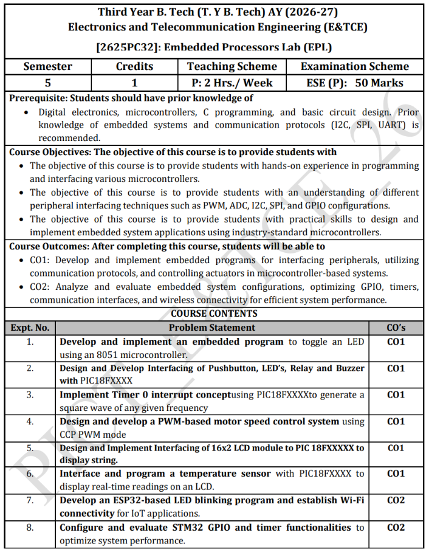

# Embedded Processors Lab (EPL) - [2625PC32]

Third Year B. Tech (T. Y. B. Tech) AY (2026-27)  
Department of Electronics and Telecommunication Engineering (E&TCE)  
Semester: 5 | Credits: 1 | Teaching Scheme: P: 2 Hrs./Week | Examination Scheme: ESE (P): 50 Marks

---

## Course Syllabus & Information

Official curriculum outline, course objectives, outcomes, and laboratory contents:



---

## Overview

This repository provides production-ready, well-structured, and thoroughly commented C and C++ source code designed to fulfill the Embedded Processor (EP) laboratory curriculum. Each assignment addresses real-world microcontroller interfacing techniques, from bare-metal register manipulation to interrupt service routines, analog-to-digital conversion, pulse-width modulation, IoT networking, and hardware timer optimization.

All implementations follow strict embedded engineering standards:
- Clear, step-by-step register-level configurations.
- Minimalistic and easy-to-understand code structure.
- Microchip C18 compatibility with USB HID bootloader vector relocation for PIC18F4550.
- Calibrated hardware delays and calculation formulas included in comments.

> [!TIP]
> **Interactive Circuit Schematics & Simulation Tool:**  
> Open **[`interfacing_diagrams.html`](interfacing_diagrams.html)** in any browser to inspect interactive, publication-quality vector schematics and run live logic simulations for Experiments 1 through 5.

---

## Course Experiments & Directory Map

| Expt. No. | Folder | Target Microcontroller | Problem Statement | Key Peripherals & Concepts |
|---|---|---|---|---|
| 1 | [Assignment1](Assignment1/) | 8051 (AT89C51/S52) | Develop and implement an embedded program to toggle an LED using an 8051 microcontroller. | GPIO Port 1, Software Delays, Bit-shifting, BCD/Hex Counting |
| 2 | [Assignment2](Assignment2/) | PIC18F4550 | Design and develop interfacing of Pushbutton, LEDs, Relay, and Buzzer with PIC18FXXXX. | TRISB, TRISC, TRISD, Port Pull-ups, Relays, Buzzers, Active-Low Buttons |
| 3 | [Assignment3](Assignment3/) | PIC18F4550 | Implement Timer 0 interrupt concept using PIC18F4550 uC to generate a square wave of 10 Hz frequency. | T0CON, INTCON, 16-bit Timer0, Vector Relocation (0x1008), 10 Hz Wave |
| 4 | [Assignment4](Assignment4/) | PIC18F4550 | Design and develop a PWM based motor speed control system using CCP PWM mode using PIC18F4550 uC. | CCP1CON, PR2, T2CON, Timer 2, 4 kHz PWM, L293D Motor Driver |
| 5 | [Assignment5](Assignment5/) | PIC18F4550 | Design and implement interfacing of 16x2 LCD module to PIC18FXXXX to display string. | HD44780 8-Bit Interface, Command/Data Sequencing, PORTE Control, PORTD Bus |
| 6 | [Assignment6](Assignment6/) | PIC18F4550 | Interface and program a temperature sensor with PIC18FXXXX to display real-time readings on an LCD. | LM35, 10-bit ADC (ADCON0/1/2), Channel AN0, Real-Time String Formatting |
| 7 | [Assignment7](Assignment7/) | ESP32 (ESP-WROOM-32) | Develop an ESP32-based LED blinking program and establish Wi-Fi connectivity for IoT applications. | GPIO 2, WiFi Station Mode, Connection Polling, Serial Diagnostics, IP Reporting |
| 8 | [Assignment8](Assignment8/) | STM32 (ARM Cortex-M) | Configure and evaluate STM32 GPIO and timer functionalities to optimize system performance. | RCC Clock Enable, GPIO Push-Pull, Hardware Timer TIM2 (PSC, ARR), Non-blocking Delays |

---

## Detailed Experiment Descriptions

### Assignment 1: 8051 Microcontroller LED Interfacing
- Location: `Assignment1/`
- Target: 8051 Architecture (AT89C51 / AT89S52)
- Compiler: Keil C51 (`reg51.h`)
- Description: Implements fundamental digital output control on 8051 Port 1. Includes full port toggling (`toggle.c`), 8-LED ring chasing sequence using logical bit-shifting (`chasing.c`), two-digit BCD up/down counter (`up_down_bcd.c`), and 8-bit hexadecimal counter (`up_down_hex.c`).

### Assignment 2: PIC18F4550 Button, Relay, Buzzer, and LED Interfacing
- Location: `Assignment2/`
- Target: PIC18F4550
- Compiler: Microchip C18 (`p18f4550.h`)
- Description: Demonstrates digital input and output control. Active-low pushbuttons on `RB0` and `RB1` with internal weak pull-ups trigger switching of a relay (`RC1`), a buzzer (`RC2`), and cascading LED chase patterns on `PORTD`. Integrated with USB HID bootloader relocation table (`vector_relocate.h`).

### Assignment 3: PIC18F4550 Timer 0 Interrupt Square Wave Generation (10 Hz)
- Location: `Assignment3/`
- Target: PIC18F4550
- Compiler: Microchip C18
- Description: Generates a calibrated 10 Hz square wave on `PORTBbits.RB0` using the 16-bit Timer 0 overflow interrupt. The High Priority Interrupt vector is relocated to address `0x1008` as specified in the PICT EPL syllabus. Calculations derive exact register values (`TMR0H = 0x6D`, `TMR0L = 0x84`, corresponding to 37,500 counts for a 50 ms half-cycle delay) based on a 48 MHz oscillator frequency and 1:16 prescaler (`T0CON = 0x03`).

### Assignment 4: PIC18F4550 CCP PWM DC Motor Speed Control (4 kHz)
- Location: `Assignment4/`
- Target: PIC18F4550
- Compiler: Microchip C18
- Description: Implements motor speed modulation using the Capture/Compare/PWM (CCP1) hardware module on pin `RC2` driving an L293D H-bridge. Configures Timer 2 (`PR2 = 186`, 1:16 prescaler at 48 MHz) to establish a 4 kHz PWM carrier frequency, and dynamically adjusts the 10-bit duty cycle (`CCPR1L` and `CCP1CON<5:4>`) through 20%, 40%, 60%, 80%, and 100% speed steps as derived in the PICT EPL manual.

### Assignment 5: PIC18F4550 16x2 Alphanumeric LCD Interfacing
- Location: `Assignment5/`
- Target: PIC18F4550
- Compiler: Microchip C18
- Description: Implements an 8-bit parallel interface driver for standard HD44780-compatible 16x2 LCD modules. Uses `PORTD` as the 8-bit bidirectional data bus and `PORTE` for control signals (`RE0 = RS`, `RE1 = RW`, `RE2 = EN`). Implements command dispatching, initialization routines, and character string rendering.

### Assignment 6: PIC18F4550 Real-Time Temperature Monitoring (LM35 + LCD)
- Location: `Assignment6/`
- Target: PIC18F4550
- Compiler: Microchip C18
- Description: Interfaces an analog LM35 precision temperature sensor to analog channel AN0 (`RA0`). Configures the 10-bit internal ADC (`ADCON0`, `ADCON1`, `ADCON2`) with 2 TAD acquisition time and Fosc/32 conversion clock. The calculated temperature in degrees Celsius is formatted and displayed in real time on the 16x2 LCD.

### Assignment 7: ESP32 LED Blink & Wi-Fi IoT Connectivity
- Location: `Assignment7/`
- Target: ESP32 Dev Module (ESP-WROOM-32)
- Environment: Arduino IDE / ESP-IDF C++
- Description: Configures the ESP32 in Station mode to establish a Wi-Fi link with a local network or mobile hotspot. The onboard blue LED (`GPIO 2`) blinks rapidly during connection negotiation, stays solid on successful association, and transitions to a diagnostic heartbeat rhythm. Diagnostic network parameters (IP address, RSSI) are streamed over UART at 115200 baud.

### Assignment 8: STM32 GPIO & Hardware Timer Performance Optimization
- Location: `Assignment8/`
- Target: STM32 (ARM Cortex-M, STM32F103 "Blue Pill" / Nucleo / Discovery)
- Environment: CMSIS Register-Level C / Keil / STM32CubeIDE
- Description: Evaluates the performance contrast between software-based busy-wait loops and dedicated hardware timers. Directly configures peripheral clocks (`RCC_APB2ENR`, `RCC_APB1ENR`), GPIO Output Push-Pull registers (`GPIOC_CRH`), and General Purpose Timer 2 (`TIM2_PSC`, `TIM2_ARR`). Demonstrates non-drifting, CPU-efficient millisecond timebase generation.

---

## Continuous Internal Evaluation (CIE) Solutions

In addition to standard course experiments, the `CIE1_Solutions/` directory contains complete projects with Proteus schematic simulation designs (`.pdsprj`), C18 source files, and engineering reports:

1. **7-Segment Display Counter (`CIE1_Solutions/1_7_Segment_Display/`):** Two-digit multiplexed common-cathode display counting from 00 to 99 on `PORTB` and `PORTD`.
2. **Smart Traffic Light Controller (`CIE1_Solutions/2_Smart_Traffic_Light/`):** Four-phase automated traffic junction sequencing with safety clearance delays.
3. **Home Automation Subsystem (`CIE1_Solutions/3_Home_Automation/`):** Multi-channel appliance switching with pushbutton inputs and status indicators.
4. **Stepper Motor 90-Degree Stepper (`CIE1_Solutions/4_Stepper_Motor_90_Degrees/`):** Precise angular positioning control using four-step unipolar excitation sequences.

---

## Development Environment & Toolchain Setup

### Microchip PIC18F4550 Projects
- **IDE:** MPLAB IDE v8.92 (or MPLAB X IDE)
- **Compiler:** Microchip MPLAB C18 v3.47 (`mcc18.exe`)
- **Linker:** MPLINK Object Linker (`mplink.exe`) with `rm18f4550.lkr`
- **Programmer / Loader:** Microchip USB HID Bootloader (PICDEM FS USB)
- **Simulation:** Proteus VSM (ISIS) v8.x

#### Building via Command Line (C18)
```powershell
# Compile C source to object file
mcc18.exe -p=18F4550 "exp3.c" -fo="exp3.o"

# Link into COFF and Intel HEX files
mplink.exe /p18F4550 "..\rm18f4550.lkr" "exp3.o" /u_CRUNTIME /z__MPLAB_BUILD=1 /o"exp_3.cof" /M"exp_3.map" /W
```

### 8051 Microcontroller Projects
- **IDE / Toolchain:** Keil uVision (C51 Compiler)
- **Simulation:** Proteus VSM

### ESP32 Projects
- **IDE:** Arduino IDE (with ESP32 board package installed) or ESP-IDF
- **Upload Speed:** 115200 / 921600 baud
- **Monitor Speed:** 115200 baud

### STM32 Projects
- **IDE:** Keil MDK-ARM uVision or STM32CubeIDE
- **Toolchain:** ARM-GCC / ARM Compiler 5/6
- **Debugger / Programmer:** ST-Link V2

---

## Repository Structure

```text
EPLabWork/
├── assets/
│   └── syllabus.png
├── Assignment1/
│   ├── chasing.c
│   ├── toggle.c
│   ├── up_down_bcd.c
│   └── up_down_hex.c
├── Assignment2/
│   ├── exp_2.mcp
│   ├── exp_2.hex
│   └── linker/
│       ├── exp2.c
│       ├── rm18f4550-HID-Bootload.lkr
│       └── vector_relocate.h
├── Assignment3/
│   ├── exp3.c
│   ├── exp_3.hex
│   ├── exp_3.cof
│   └── exp_3.mcp
├── Assignment4/
│   ├── exp4.c
│   ├── exp_4.hex
│   ├── exp_4.cof
│   └── exp_4.mcp
├── Assignment5/
│   ├── exp5.c
│   ├── exp_5.hex
│   ├── exp_5.cof
│   └── exp_5.mcp
├── Assignment6/
│   ├── exp6.c
│   ├── exp_6.hex
│   ├── exp_6.cof
│   └── exp_6.mcp
├── Assignment7/
│   ├── exp7.c
│   └── exp7.ino
├── Assignment8/
│   └── exp8.c
├── CIE1_Solutions/
│   ├── 1_7_Segment_Display/
│   ├── 2_Smart_Traffic_Light/
│   ├── 3_Home_Automation/
│   └── 4_Stepper_Motor_90_Degrees/
├── rm18f4550.lkr
├── vector_relocate.h
└── README.md
```

---

## Technical Highlights

- **Direct Register Manipulation:** Code interacts directly with peripheral registers (`TRIS`, `PORT`, `LAT`, `ADCON`, `T0CON`, `CCP1CON`, `RCC`, `TIM`), reinforcing architectural understanding without opaque abstraction layers.
- **Interrupt Vector Relocation:** Addresses USB HID bootloader memory constraints by relocating reset and interrupt jump tables from `0x0000` to `0x1000` and `0x1008`.
- **Calculation Verification:** All timer periods, prescaler divisions, ADC voltage conversions, and PWM frequencies contain mathematical derivations embedded in file headers.
- **Dual-Format Compatibility:** ESP32 code is packaged for both standard C/C++ build pipelines and Arduino IDE workflows.

---

## Author & Academic Information

- **Institution:** Department of Electronics & Telecommunication Engineering
- **Laboratory Course:** Embedded Processors Laboratory (EP Lab)
- **Repository:** SanTiwari07 / EP (https://github.com/SanTiwari07/EP)
